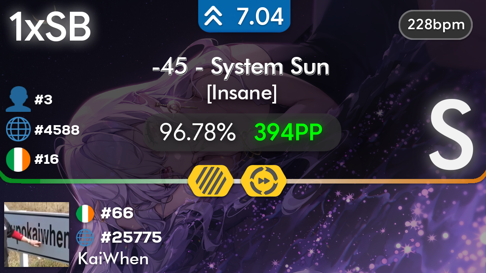
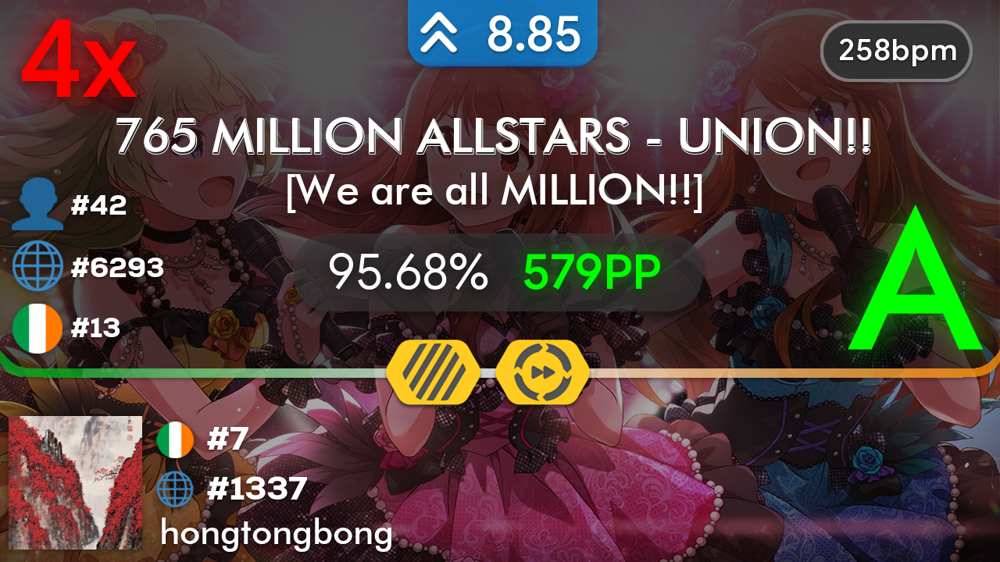

## Automated osu! Replay Video Uploader

This project is a rewrite of [oie-replay-uploader-old](https://github.com/KaiWhen/oie-replay-uploader-old)
with many improvements and more features. It is mainly used for uploading Ireland's replays.
 
The bot mainly does the following:
- Tracks top 10 personal pp plays and #1 global scores of the top 100 players of Ireland.
- Renders videos using [o!rdr](https://ordr.issou.best/), an osu! replay rendering service.
- Automatically uploads to the [osu!Ireland Replays](https://www.youtube.com/@osuIrelandReplays)
YouTube channel and automatically generates the thumbnails.
- Players can request a score's replay to be uploaded through a Google Form, which is automatically handled
and sent into a Discord channel for approval using a Discord bot.
- Players can also attach a replay file if a downloadable replay is unavailable on osu!.

### Thumbnail Examples

